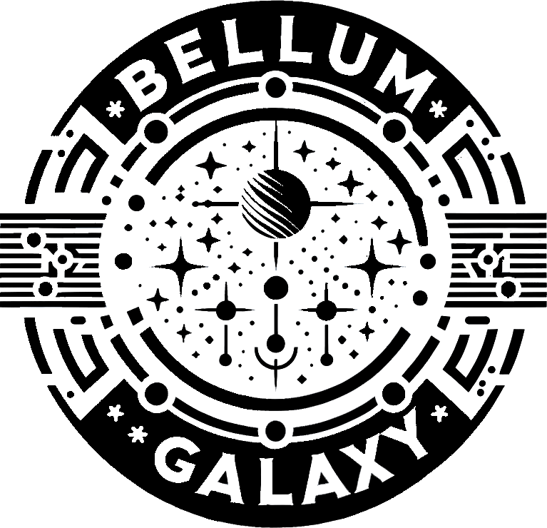

# Smart Contract Audit Report

## General Information

- **Project Name:**
- **Smart Contract Address:**
- **Audit Date:**
- **Audit Tools Used:**
- **Auditors:**

## Executive Summary

A brief overview of the audit's purpose and scope, including key aspects of the audited smart contract.

## Methodology

Description of the methodology used in the audit. Include details about static analysis tools, manual code review, etc.

## Audit Findings

### Critical Vulnerabilities

- **Vulnerability 1**
  - **Description:**
  - **Impact:**
  - **Proof of Concept:**
  - **Recommendation:**
  - **Status:**

### High Severity Vulnerabilities

- **Vulnerability 2**
  - **Description:**
  - **Recommendation:**
  - **Status:**

### Medium Severity Vulnerabilities

- **Vulnerability 3**
  - **Description:**
  - **Recommendation:**
  - **Status:**

### Minor Observations

- **Observation 1**
  - **Description:**
  - **Recommendation:**
  - **Status:**

## Conclusion

A general summary of the findings and an overall assessment of the smart contract's security.

## Appendices

Any code, images, or other attachments that are relevant to the report.

---
